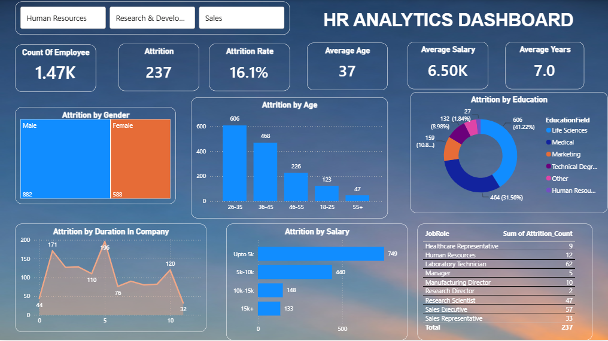

# 📊 HR Analytics Dashboard

## 📌 Project Overview

The HR Analytics Dashboard is an interactive Power BI project designed to analyze employee attrition and identify the key factors influencing workforce turnover. The dashboard enables HR professionals and business leaders to monitor employee trends, understand attrition patterns, and make data-driven decisions to improve employee retention.

---

## 🎯 Business Problem

Employee attrition is a major challenge for organizations as it increases recruitment costs, impacts productivity, and results in the loss of experienced employees.

This project aims to answer important business questions such as:

- Which employees are most likely to leave?
- Which age group has the highest attrition?
- Does salary influence employee turnover?
- Which education backgrounds contribute to higher attrition?
- Which job roles experience the highest employee turnover?
- How does employee tenure affect attrition?

---

## 📈 Dashboard Preview

---

## 📊 Key KPIs

| KPI | Value |
|------|-------|
| Total Employees | 1,470 |
| Attrition Count | 237 |
| Attrition Rate | 16.1% |
| Average Age | 37 Years |
| Average Salary | 6.5K |
| Average Years at Company | 7 Years |

---

## 📌 Dashboard Features

- Executive KPI Cards
- Department-wise Filtering
- Attrition by Age Group
- Attrition by Salary Group
- Attrition by Education Field
- Gender-wise Employee Distribution
- Attrition by Years at Company
- Job Role-wise Attrition Analysis
- Interactive Slicers
- Dynamic Power BI Visualizations

---

## 🔍 Key Insights

### 👥 Age Analysis
- Employees aged **26–35 years** have the highest attrition.
- Attrition decreases as employee age increases.

### 💰 Salary Analysis
- Employees earning **up to 5K** experience the highest turnover.
- Higher salary groups show significantly lower attrition.

### 🎓 Education Analysis
- Employees from **Life Sciences** and **Medical** backgrounds contribute the largest share of attrition.

### ⏳ Experience Analysis
- Attrition is highest among employees with around **5 years** of service.
- Employee turnover decreases for longer-serving employees.

### 💼 Job Role Analysis
- Certain job roles experience higher attrition than others, helping HR identify positions requiring improved retention strategies.

### 🚻 Gender Analysis
- The dashboard compares employee distribution across male and female employees for workforce analysis.

---

## 🛠 Tools & Technologies

- Power BI
- Power Query
- DAX
- Microsoft Excel
- Data Modeling
- Data Cleaning
- Data Visualization

---

## 📂 Dataset

The dataset contains HR employee information including:

- Employee ID
- Department
- Job Role
- Age
- Gender
- Education
- Monthly Salary
- Years at Company
- Attrition Status

---

## 💡 Business Impact

This dashboard helps organizations:

- Monitor employee turnover.
- Identify high-risk employee groups.
- Understand the major factors influencing attrition.
- Improve employee retention strategies.
- Support data-driven HR decision-making.

---

## 🚀 Skills Demonstrated

- Data Cleaning
- Data Modeling
- DAX Measures
- Power Query Transformations
- KPI Development
- Interactive Dashboard Design
- Business Intelligence
- HR Data Analysis

---

## ⭐ Future Improvements

- Attrition Prediction using Machine Learning
- Department-wise Retention Analysis
- Employee Satisfaction Dashboard
- Hiring vs Attrition Trend Analysis
- Performance Rating Analysis

---

## 👨‍💻 Author

**Harshvardhan Sahu**

Aspiring Data Analyst | Power BI | SQL | Excel | Python
